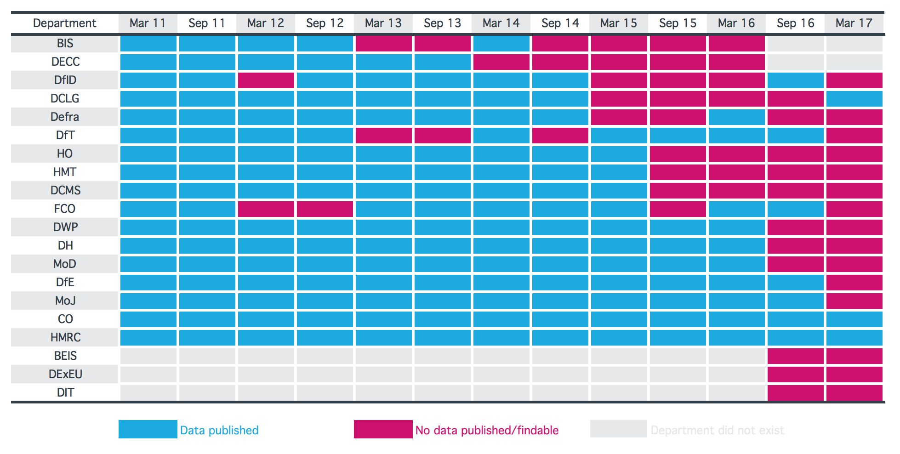
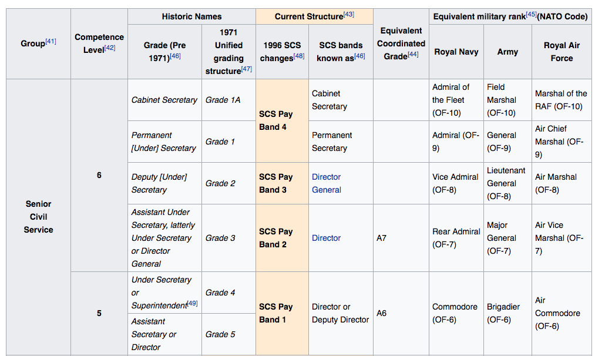

```{r setup, include=FALSE}
knitr::opts_chunk$set(echo = TRUE)
```

## Background  

[Departmental organograms](https://www.instituteforgovernment.org.uk/blog/hacking-organograms-unlocking-government-data) are a great example of how transparency data can be used to assess Government effectiveness.  
In May 2010, [David Cameron wrote](https://www.gov.uk/government/news/letter-to-government-departments-on-opening-up-data) to government departments asking them to publish an organogram showing a snapshot of their staff - the salaries, grades, roles, professions and units - every six months. 

```{r echo=FALSE, out.width='100%'}

```

## The data

Some missing data, some departments are better than others.

```{r echo=FALSE, out.width='100%'}

```

## Using data.trees to look at our hierarchial data

We wrote a script to read in the HMRC data as it is the most complete. This included some filtering and cleaning of the data.

```{r}
library(tidyverse)
library(readxl)
library(stringr)

data_file <- "./Departmental_organograms_gov.uk_data.gov_.uk_4_7_2017.xlsx"

sheets <- excel_sheets(data_file)
org_sheets <- sheets[str_detect(sheets, "^Collated\\.")]

# org_data <-
#   org_sheets %>%
#   map_df(~ read_excel(data_file,
#                       sheet = .x,
#                       col_types = "text"),
#          .id = "org") %>%
#   mutate(org = org_sheets[as.integer(org)])

# org_data_list <- map(org_sheets,
#                      ~ read_excel(data_file,
#                                   sheet = .x,
#                                   col_types = "text"))

# map(org_data_list, colnames) %>%
#   map(count)

hmrc_sheet_name <- "Collated.HMRC"
hmrc_data <- read_excel(data_file, hmrc_sheet_name)

# TODO: Clean
# CBE
# Double spaces
# richard summergill | richard summersgill cbe

# sort(table(tolower(hmrc_data$Name)))

small_data <-
  hmrc_data %>%
  filter(!(Name %in% c("N/D", "VACANT", "Vacant", "Eliminated"))) %>%
  filter(!is.na(Name)) %>%
  select(`Post Unique Reference`,
         `Name`,
         `Grade (or equivalent)`,
         `Reports to Senior Post`,
         `Organisation`)

map(small_data, ~ length(unique(.x)))


write_tsv(small_data, "hmrc.tsv")

# Post Unique Reference
# Name
# Grade (or equivalent)
# Reports to Senior Post
# Organisation
```


Let's solve for one department as another group are collating the sheets.

### Treating as a tree not a dataframe

People often try to resolve hierarchical problems in a tabular fashion, for instance with data frames. But often, hierarchies don’t marry with tables, and various workarounds are usually required. Let's prepare the data acknowledging the inherent hierarchy.  

We load a suitable package.

```{r}
library(data.tree)
```

## Explore the data

Read in as characters, let's use unique to help see the variety.

Our data appears to be succesfully filtered.  

```{r}
unique(small_data$Organisation)
```

Let's get an idea of what the data looks like.

```{r}
glimpse(small_data)
```

There's `r unique(small_data$Name)` unique Names among the `r nrow(small_data)`.

## Control for job sharing

Some senior roles share jobs, thus the post unique reference may have two or more names associated with it. This is not tidy data, we should create a unique variable by combining `Post Unique Reference` with `Name`.

## Prepare tree structure

Let’s convert that into a `data.tree` structure! We start by defining a pathString. The pathString describes the hierarchy by defining a path from the root to each leaf. In this example, the hierarchy comes very naturally:

```{r}
small_data$pathString <- paste(unique(small_data$Organisation), 
                            small_data$`Reports to Senior Post`, 
                            sep = "/")
```

Once our pathString is defined, conversion to Node is very easy:

```{r}
organo <- as.Node(small_data)
# names(small_data)
print(organo, "Name", "Post Unique Reference",
      "Grade (or equivalent)", limit = 20)
```

This isn't in the structure we want, we may need to reshape. Let's try and read in the data again making it a bit tidier.  

## Attempt 2 - tidying data

### Treating as a tree not a dataframe

People often try to resolve hierarchical problems in a tabular fashion, for instance with data frames. But often, hierarchies don’t marry with tables, and various workarounds are usually required. Let's prepare the data acknowledging the inherent hierarchy.  

We load a suitable package.

```{r}
library(data.tree)
```

Let's take our initial script and get the data necessary to answer our question, as our interests have diverged. We are interested in getting the data into suitable format to be compatible with the `data.tree` format and all the opportunity this will provide (https://cran.r-project.org/web/packages/data.tree/vignettes/applications.html). We need hierarchial data.  

```{r}
library(tidyverse)
library(readxl)
library(stringr)

# TODO: Clean
# CBE
# Double spaces
# richard summergill | richard summersgill cbe

data_file <- "./Departmental_organograms_gov.uk_data.gov_.uk_4_7_2017.xlsx"

sheets <- excel_sheets(data_file)
#  vectorise over string and pattern
org_sheets <- sheets[str_detect(sheets, "^Collated\\.")]

org_data <-
  org_sheets %>%
  map_df(~ read_excel(data_file,
                      sheet = .x,
                      col_types = "text",
                      na = c("", "N/A"))) %>%
  # mutate(org = org_sheets[as.integer(org)]) %>%
  rename(quarter = `Back to Index`,
         post = `Post Unique Reference`,
         name = `Name`,
         grade = `Grade (or equivalent)`,
         superior = `Reports to Senior Post`,
         org = `Parent Department`,
         job = `Job Title`,
         department = `Parent Department`,
         organisation = `Organisation`,
         unit = `Unit`,
         pay = `Total Pay (£)`,
         fte = `FTE`,
         pay_ceiling = `Actual Pay Ceiling (£)`,
         pay_floor = `Actual Pay Floor (£)`) %>%
  select(quarter, post, name, grade, superior, organisation,
         job, department, organisation, unit, pay,
         fte, pay_ceiling, pay_floor)

# hmrc_sheet_name <- "Collated.HMRC"
# hmrc_data <- read_excel(data_file, hmrc_sheet_name)

small_data <-
  org_data %>%
  mutate(name = tolower(name)) %>%
  filter(!is.na(post),
         !is.na(name),
         !(name %in% c("n/d",
                     "nd",
                     "na",
                     "n/d'",
                     "eliminated.",
                     "eliminated'",
                     "\"eliminated\"",
                     "vacant",
                     "'vacant'",
                     "eliminated",
                     "'eliminated'",
                     "new post"))) %>%
  mutate(quarter = openxlsx::convertToDate(quarter))
```

Let's look at our data.

```{r}
glimpse(small_data)
```

Let's see how the missingness of the data. The different missing patterns are displayed giving us the proportions of missings by variables and the relative frequency of each pattern.  

```{r}
extracat::visna(small_data, sort = "b")
```

`pay` is missing very often, and `pay_ceiling` is missing more than `pay_floor`.

### Pay ceiling through time

However we can still interrogate the data.

```{r}
small_data %>% 
  group_by(quarter) %>% 
  summarise(pay_cap = mean(as.numeric(pay_ceiling), na.rm = TRUE)) %>%
  plot(., type = "l")
```

Problematic data, need to clean and tidy but only here for one day!

## Tidy data

We try again, this type with the relevant variables in place. However, we need to order our variables and convert to factors where appropriate. We should also make it tidy data by having one row per unique person, we can do this by combining post. Let's keep things simple by looking our most recent quarter, then we can use `purrr` later to do it iteratively over each quarter. Let's take the quarter with the most data, `max(table(small_data$quarter))` (We have revisited this and used all the quarters as you can see in the code below).

```{r message=FALSE}
# Correct type of variables
# ----
# names(easy_data)
# inspect data, any need normalising? or logicising or 
# to_normalise <- names(select(d, -outcome))
factorise  <- c("quarter", "grade", "organisation", "job",
                "department", "unit")
logicise <- c()
numericise <- c("pay", "fte", "pay_ceiling", "pay_floor")

# correct the type

typed_data <- small_data %>%
  mutate_each_(funs(as.factor), factorise) %>%
  mutate_each_(funs(as.numeric), numericise) 

# if we look at the grades, we see inconsitent naming
# table(typed_data$grade)
# let's make them the same and order them
# for pay bands see
# https://en.wikipedia.org/wiki/Civil_Service_(United_Kingdom)#Codes

# we convert to grade character, to recode the old levels
# to something consistent
# ----
  # define translation
  scs4 = c("OF-9", "Perm Sec", "SCS4",
                      "Permanent Secretary", "SCS 4")
  scs3 = c("Director General", "OF-8",
                      "SCS 3", "SCS Band 3", "SCS3")
  scs2 = c("Director", "OF-7",
                      "SCS 2", "SCS Band 2", "SCS2")
  scs1 = c("OF-6", "SCS1", "SCS1A")
  

corrected_grades <- mutate(typed_data,
                           grade = forcats::fct_recode(grade,
                             SCS4 = "OF-9",
                             SCS4 = "Perm Sec",
                             SCS4 = "SCS4",
                             SCS4 ="Permanent Secretary",
                             SCS4 = "SCS 4"
                           )) %>%
  mutate(
                           grade = forcats::fct_recode(grade,
                             SCS3 = "Director General",
                             SCS3 = "OF-8", 
                             SCS3 = "SCS 3", 
                             SCS3 = "SCS Band 3", 
                             SCS3 = "SCS3"
                           ))  %>%
    mutate(
                           grade = forcats::fct_recode(grade,
                             SCS2 = scs2[1],
                             SCS2 = scs2[2], 
                             SCS2 = scs2[3], 
                             SCS2 = scs2[4], 
                             SCS2 = scs2[5]
                           ))  %>% 
      mutate(
                           grade = forcats::fct_recode(grade,
                             SCS1 = scs1[1],
                             SCS1 = scs1[2], 
                             SCS1 = scs1[3]
                           )) %>%
        mutate(
                           grade = forcats::fct_relevel(grade,
                             "SCS4",
                             "SCS3", 
                             "SCS2"
                           )) 
  
# ----


# tidy data, one row per id and name? worry about this later


# Make it just one quarter, one snip in time
easy_data <- corrected_grades 
# %>%
#   filter(quarter == "2014-03-01")


```

This code correct for the different encodings across departments for the Senior Civil Service. I tried to vectorise with forcats but couldn't work at how to do it simply.  

```{r echo=FALSE, out.width='100%'}

```

Let's look at our data. We might want to look at a few Departments of interest as there seems to be variation in their names and difference in employes.

```{r}
# easy_data <- easy_data %>% 
#   filter(organisation == "Ministry of Defence" |
#           organisation == "Ministry of Justice" |
#            organisation == "Her Majesty's Revenue and Customs" |
#            organisation == "HM Treasury" |
#            organisation == "Foreign and Commonwealth office" |
#            organisation == "DFID" |
#            organisation == "Department for Transport" |
#            organisation == "Cabinet Office" |
#            organisation == "Department for Business Innovation and Skills")
```

Most of the data is missing for pay for some reason. We take a short cut here by plotting the expect salary as the midpoint between the ceiling and floor.

```{r}
#drop levels
easy_data <- easy_data %>%
  mutate(pay = (pay_ceiling + pay_floor)/2) 
# %>%
#   droplevels()
library(treemap)
treemap(easy_data,
       index=c("department", "grade"),
       vSize="pay",
       type="value")
```

## Prepare tree structure

> Abraham Lincoln once said, "Give me six hours to chop down a tree and I will spend the first four sharpening the axe." 
Aunt Margaret used to say, "If you dream of a forest, you'd better learn how to plant a tree." 
data.tree says, "No matter if you are a lumberjack or a tree hugger. I will be your sanding block, and I will be your seed."

### the package

This package offers an alternative. The data.tree package lets you create hierarchies, called data.tree structures. The building block of theses structures are Node objects. The package provides basic traversal, search, and sort operations, and an infrastructure for recursive tree programming. You can decorate Nodes with your own fields and methods, so as to extend the package to your needs.

The package also provides convenience methods for neatly printing and plotting trees. It supports conversion from and to data.frames,  lists, and other tree structures such as dendrogram, phylo objects from the ape package, igraph, and other packages.

Technically, data.tree structures are bi-directional, ordered trees. Bi-directional means that you can navigate from parent to chidren and vice versa. Ordered means that the sort order of the children of a parent node is well-defined.

### Our first tree

Let’s convert that into a `data.tree` structure! We start by defining a pathString. The pathString describes the hierarchy by defining a path from the root to each leaf. In this example, the hierarchy comes very naturally:

Let's try making it into a tree.

Where we have Department, organisation, unit hierarchy encapsulated.

```{r}
library(data.tree)
# missing data causes problems later
easy_data <- na.omit(easy_data)

easy_data$pathString <- paste("civil_service",
                               easy_data$department,
                              easy_data$organisation,
                               easy_data$unit,
                              easy_data$grade,
                              easy_data$name,
                              sep = "/")
tree <- as.Node(easy_data[,])
print(tree, pruneMethod = "dist", limit = 20)
```

We can also navigate the tree to find the pay of a specific `department`, `organisation`, `unit`. Makes working with the data is the relationships are intrinsic to the data. Presumably that speeds up filtering and searches?

```{r}
tree$`Department for Education`

```

You can also extract info from the leaves.

```{r}
tree$`Department for Education`$`Education Funding Agency`$`Education Funding Agency`$SCS2$`simon parkes`$pay
```


How is this useful?

Well you can work out the branchiness of a Department which might indicate the complexity.

In computing, tree data structures, and game theory, the branching factor is the number of children at each node, the outdegree. If this value is not uniform, an average branching factor can be calculated.

```{r}
tree$`Cabinet Office`$children

```
We can look at it and then quantify it also.

```{r}
tree$`Cabinet Office`$averageBranchingFactor

```

Thus we can quantify the complexity, debateably.

```{r}
tree$`Ministry of Defence`$children
```


```{r}
tree$`Ministry of Defence`$averageBranchingFactor

```

Much higher branching factor! Although we haven't controlled for time, this is across all quarters and we know the data had different missingness patterns for the different departments.

### Neat sort functionality

```{r}
dfe <- tree$`Department for Education`
Sort(dfe, "pay", decreasing = TRUE)
print(dfe, "department", "unit", "grade", "pay", limit = 12)
```

### Big earner

Or we can find out the name of the largest `pay` for an individual. Which is...

```{r}
max_pay <- Aggregate(tree, "pay", max)

#same thing, in a more traditional way:
# although sapply is inconsistent, shouldnt use
max_pay <- max(sapply(tree$leaves, function(x) x$pay))

tree$Get("name", filterFun = function(x) x$isLeaf && x$pay == max_pay)
```

### Aggregating, cumulative pay

We aggregate the pay For non-leaves, this will recursively iterate through children, and cache the result in the pay field.

```{r}
tree$Do(function(x) {
        x$pay <- Aggregate(node = x,
        attribute = "pay",
        aggFun = sum)
        }, 
     traversal = "post-order")
```

Next we sort each node by pay.

```{r}
Sort(tree, attribute = "pay", decreasing = TRUE, recursive = TRUE)

```

Finally, we cumulate among siblings, and store the running sum in an attribute called `cum_pay`:

```{r}
tree$Do(function(x) x$cum_pay <- Cumulate(x, "pay", sum))

```

The tree now looks like this:

```{r}
print(tree, "pay", "cum_pay", pruneMethod = "dist", limit = 20)

```


## Pruning the tree

We could also opt to prune for those smaller `units` that make up the `department`s.

The previous steps were done to define our threshold: big units should be displayed, while small ones should be grouped together. This lets us define a pruning function that will allow a maximum of 5 organisations per department, and that will prune all organisations making up less than 90% of a department's pay.

Store the orginal number of units for later use:

```{r}
tree$Do(function(x) x$origCount <- x$count)

```

We are ready to prune. We know that the MOD has many `organisation`s and branches. Let's prune that down to the most important ones that make up at least 90% of the cumulative pay or the top 3 organisations.  

```{r}
myPruneFun <- function(x, cutoff = 0.9, maxCountries = 3) {
  if (isNotLeaf(x)) return (TRUE)
  if (x$position > maxCountries) return (FALSE)
  return (x$cum_pay < (x$parent$pay * cutoff))
}
```

We clone the tree, because we might want to play around with different parameters:

```{r}
treeClone <- Clone(tree, pruneFun = myPruneFun)
print(treeClone$`Ministry of Defence`, "pay", pruneMethod = "simple", limit = 20)
```

We need to sum the organisations we pruned into an other category.

```{r}
treeClone$Do(function(x) {
  missing <- x$pay - sum(sapply(x$children, function(x) x$pay))
  other <- x$AddChild("Other")
  other$iso3 <- paste0("OTH(", x$origCount, ")")
  other$country <- "Other"
  other$continent <- x$name
  other$GNI <- 0
  other$pay <- missing
},
filterFun = function(x) x$level == 2
)


print(treeClone$`Cabinet Office`, "pay", pruneMethod = "simple", limit = 20)
```

## Plotting stuff

In order to plot, need to convert back to data.frame.


```{r}
df <- ToDataFrameTable(treeClone, "department", "organisation", "unit", "grade", "pay")

treemap(df,
        index=c("department", "organisation", "unit"),
        vSize="pay",
        vColor="grade",
        type="value")
```

The civil service, the darker the colour the higher the grade. Each little square represents a leaf or an individual named person in that department. With the area proportional to their pay.

### Dendrogram

```{r eval = FALSE}
plot(as.dendrogram(treeClone, heightAttribute = "pay"))
# data(acme)
# plot(as.dendrogram(acme))

```

## ggtree

```{r}
## try http:// if https:// URLs are not supported
# source("https://bioconductor.org/biocLite.R")
# biocLite("BiocUpgrade") # you may need this
# biocLite("ggtree")
# ggplot(tree, aes(x, y)) + geom_tree() + theme_tree()

```
fail

## nicer tree

```{r}
# Install the package and set the RNG state
devtools::install_github('johnbaums/trees')
set.seed(1)
library(trees)

# Create a tree seed    
s <- seed(70, 10, min.branch.length=0, max.branch.length=4,
          min.trunk.height=5, max.trunk.height=8)

head(s, 10)
g <- germinate(s, col='peachpuff4')

leafygreens <- colorRampPalette(paste0('darkolivegreen', c('', 1:4)))(100)
foliate(g, 5000, 4, pch=24:25, col=NA, cex=1.5, bg=paste0(leafygreens, '30'))


```

## session info

```{r}
sessionInfo()
```

